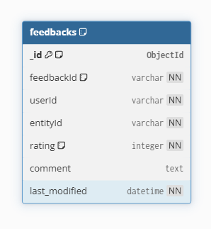

# Review and Feedback Microservice

## Overview
This microservice handles customer feedback and reviews for consumed entities. It allows customers to submit initial ratings and comments, as well as update their previously submitted feedback.

## Team Members
- Lev: Main implementation (API endpoints, business logic)
- Thomas: Initial setup + deployment/Docker configuration
- Olivia: Database schema design, MongoDB integration & helper functions, CORS and environment configuration, UML diagrams, Testing

## User Stories

### 1. Submit Initial Feedback
**As a customer**, I want to submit my initial rating and written comment for a consumed entity so that I can officially record and share my experience with the system.

**Acceptance Criteria:**
- Functional: Logged-in customers can submit feedback with User ID, Entity ID, 1–5 star rating, and comment
- Non-functional (Usability): API endpoint requires maximum of three core fields for feedback submission

### 2. Update Existing Feedback
**As a customer**, I want to edit the rating or comment of feedback I previously submitted so that I can update my feedback if my experience with the entity changes over time.

**Acceptance Criteria:**
- Functional: Customers can update their own feedback with verification of User ID and modification timestamp
- Non-functional (Securability): Clear audit logs of all modifications including before/after states

## Technology Stack
- **Language**: Python 3.9
- **Framework**: Flask 3.0.0
- **Database**: MongoDB with pymongo 4.6.0
- **CORS**: Flask-Cors 4.0.0
- **Environment**: python-dotenv 1.0.0

## Getting Started

### Prerequisites
- Docker installed on your machine
- Python 3.9+ (for local development)
- MongoDB running locally or accessible via URI

### Installation

#### Using Docker (Recommended)
```bash
# Build the Docker image
docker build -t review-and-feedback-service .

# Run the container
docker run review-and-feedback-service
```

#### `docker-compose.yml` Setup
```yml
networks:
  mynetwork:
    driver: bridge   #Allows you to interact with other microservices within container

review-and-feedback-microservice:
    build: ./Review-And-Feedback-Microservice
    image: review-and-feedback-microservice
    ports:
      - "5005:5005"
    environment:
      FLASK_APP: app.py
      FLASK_ENV: development
    networks:
      - mynetwork
```
Then if you want to call on this microservice INSIDE the container, Instead of
```bash
http://localhost:5005/<route>
```
You will have to use:
```base
http://review-and-feedback-microservice:5005/<route>
```
> [!WARNING]  
> This won't work if you're trying to call it from outside the container. For that use localhost


#### Local Development
```bash
# Install dependencies
pip install -r requirements.txt

# Copy .env.example to .env and configure
cp .env.example .env

# Run the application
python app.py
```

## Configuration

### Environment Variables
- `MONGO_URI`: MongoDB connection string 
- `PORT`: Server port 
- `CORS_ORIGINS`: Comma-separated list of allowed origins 

Refer to the `.env.example` file for a complete configuration template, 
and copy it into a new `.env` file before running the service.

## API Endpoints

### Health Check
```
GET /health
```
Returns the health status of the microservice.

**Response:**
```json
{
  "message": "Review and Feedback Microservice Online"
}
```

### Submit Feedback
```
POST /feedback
```

**Request Body:**
```json
{
  "userId": "string",
  "entityId": "string",
  "rating": 5,
  "comment": "string" 
}
```

**Response (201 Created):**
```json
{
  "message": "Feedback received",
  "feedbackId": "uuid",
  "userId": "string",
  "entityId": "string",
  "rating": 5,
  "comment": "string"
}
```

### Update Feedback
```
PUT /feedback/{feedbackId}
```

**Request Body:**
```json
{
  "userId": "string",
  "rating": 4,  
  "comment": "string" 
}
```

**Response (200 OK):**
```json
{
  "message": "Feedback updated",
  "feedbackId": "uuid",
  "changes": {
    "rating": 4,
    "comment": "string"
  }
}
```

## Database Schema

### Feedbacks Collection (MongoDB)



| Field | Type | Required | Description |
|-------|------|----------|-------------|
| _id | ObjectId | Yes | MongoDB auto-generated ID |
| feedbackId | String | Yes | Unique feedback identifier (UUID) |
| userId | String | Yes | User who submitted feedback |
| entityId | String | Yes | Entity being reviewed |
| rating | Integer | Yes | Rating (1-5 stars) |
| comment | Text | No | Optional feedback comment |
| last_modified | DateTime | Yes | Last modification timestamp (UTC) |

## UML Diagrams
(To be created by Olivia)

## Testing
(To be implemented by Olivia)

## Project Structure
```
├── Review-And-Feedback-Microservice/
|   ├── app.py                  # Main application file
|   ├── requirements.txt        # Python dependencies
|   ├── Dockerfile              # Docker configuration
|   ├── .env.example            # Environment variables template
|   ├── images/                 # Database diagrams and images
|   │   └── database-schema.png
|   └── README.md               # Project documentation
└── docker-compose.yml
```

## Development Status
- [x] Initial Flask setup
- [x] Docker configuration
- [x] CORS configuration
- [x] Database schema design
- [x] API endpoint implementation
- [x] MongoDB integration
- [ ] Authentication/Authorization
- [ ] Audit logging integration
- [ ] UML diagrams
- [ ] Unit tests
- [ ] Integration tests

## Contributing

### Team Responsibilities
- **Lev**: Main implementation (API endpoints, business logic)
- **Thomas**: Initial setup (completed) + deployment/Docker configuration
- **Olivia**: MongoDB integration, database schema, helper functions, CORS/env setup, UML diagrams, and testing

Please coordinate with team members before making major changes to shared components.